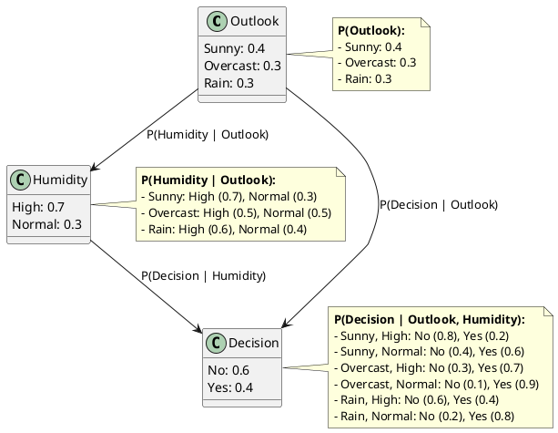

**Bayesian Networks (BNs)**, also known as Belief Networks or Bayes Nets, are graphical models that represent probabilistic relationships among a set of variables. They are widely used in various fields such as medicine, finance, artificial intelligence, and more for reasoning under uncertainty.

**Key Concepts:**

1. **Nodes and Edges:**

   - **Nodes:** Each node in a Bayesian network represents a random variable, which can be discrete or continuous.
   - **Edges:** Directed edges (arrows) between nodes represent conditional dependencies. If there is an edge from node $A$ to node $B$, it indicates that $B$ is conditionally dependent on $A$.

2. **Directed Acyclic Graph (DAG):**

   - A Bayesian network is a type of DAG, meaning it has no directed cycles. This ensures that the network represents a valid probability distribution.

3. **Conditional Probability Tables (CPTs):**

   - Each node has an associated CPT that quantifies the effect of the parent nodes on it. For a node with no parents, the CPT reduces to a prior probability distribution.

4. **Joint Probability Distribution:**

   - The network encodes the joint probability distribution of all variables. For a set of variables $X_1, X_2, \ldots, X_n$, the joint distribution is given by:
     $$
     P(X_1, X_2, \ldots, X_n) = \prod_{i=1}^n P(X_i | \text{Parents}(X_i))
     $$
   - This factorization is possible due to the conditional independence assumptions represented by the network structure.

5. **Inference:**

   - Inference in Bayesian networks involves computing the posterior distribution of some variables given evidence about others. This can be done using exact methods (e.g., variable elimination, junction trees) or approximate methods (e.g., Monte Carlo simulations).

6. **Learning:**
   - Bayesian networks can be learned from data. This involves structure learning (determining the graph structure) and parameter learning (estimating the CPTs).

**Example:**
Consider a simple Bayesian network with three variables: $A$, $B$, and $C$. If $A$ influences $B$ and $B$ influences $C$, the network would have edges $A \rightarrow B$ and $B \rightarrow C$. The joint probability distribution would be:

$$
P(A, B, C) = P(A) \cdot P(B | A) \cdot P(C | B)
$$

## Nodes and Edges in Bayesian Networks

**Nodes:**

- In a Bayesian network, each node represents a random variable. These variables can be of different types:
  - **Discrete Variables:** Variables that take on a finite set of values (e.g., weather conditions: sunny, rainy, cloudy).
  - **Continuous Variables:** Variables that can take on any value within a range (e.g., temperature, height).

**Edges:**

- Directed edges (arrows) between nodes represent conditional dependencies. If there is an edge from node $A$ to node $B$, it indicates that $B$ is conditionally dependent on $A$. This means the probability distribution of $B$ is influenced by the value of $A$.

**Conditional Independence:**

- One of the key features of Bayesian networks is that they encode conditional independence relationships. If two nodes are not connected by a directed path, they are conditionally independent given their parents. This property helps in simplifying the computation of joint probabilities.
- Two variables $X$ and $Y$ are said to be conditionally independent given a third variable $Z$ if the probability distribution of $X$ given $Z$ does not depend on $Y$, and vice versa. Mathematically, this is expressed as:
  $$
  P(X | Y, Z) = P(X | Z)
  $$
  This means that once $Z$ is known, $Y$ provides no additional information about $X$.

## Conditional Probability Tables (CPTs)

**Conditional Probability Tables (CPTs):**

- Each node in a Bayesian network has an associated **Conditional Probability Table (CPT)** that quantifies the probabilistic relationships between the node and its parents.
- The CPT specifies the probability distribution of the node given all possible combinations of its parents' states.

**Structure of CPTs:**

- For a node with no parents (root node), the CPT contains the **prior probabilities** of the node's states.
- For a node with parents, the CPT contains the **conditional probabilities** of the node's states given each possible combination of its parents' states.

**Example:**
Consider a Bayesian network with three nodes:

- $A$ (no parents): Represents "Rain" (with states: True, False).
- $B$ (parent: $A$): Represents "Wet Grass" (with states: True, False).
- $C$ (parent: $B$): Represents "Slippery Sidewalk" (with states: True, False).

**CPT for $A$ (Rain):**

- Since $A$ has no parents, its CPT contains the prior probabilities:
  $$
  P(A = \text{True}) = 0.3, \quad P(A = \text{False}) = 0.7
  $$

**CPT for $B$ (Wet Grass):**

- $B$ depends on $A$, so its CPT specifies the probability of $B$ being True or False given $A$:
  $$
  \begin{array}{c|cc}
  A & P(B = \text{True} | A) & P(B = \text{False} | A) \\
  \hline
  \text{True} & 0.8 & 0.2 \\
  \text{False} & 0.1 & 0.9 \\
  \end{array}
  $$
  - If it rains ($A = \text{True}$), the probability of wet grass ($B = \text{True}$) is 0.8.
  - If it does not rain ($A = \text{False}$), the probability of wet grass ($B = \text{True}$) is 0.1.

**CPT for $C$ (Slippery Sidewalk):**

- $C$ depends on $B$, so its CPT specifies the probability of $C$ being True or False given $B$:
  $$
  \begin{array}{c|cc}
  B & P(C = \text{True} | B) & P(C = \text{False} | B) \\
  \hline
  \text{True} & 0.7 & 0.3 \\
  \text{False} & 0.1 & 0.9 \\
  \end{array}
  $$
  - If the grass is wet ($B = \text{True}$), the probability of a slippery sidewalk ($C = \text{True}$) is 0.7.
  - If the grass is not wet ($B = \text{False}$), the probability of a slippery sidewalk ($C = \text{True}$) is 0.1.

**Key Points:**

- CPTs encode the probabilistic relationships between nodes and their parents.
- They allow the network to compute the joint probability distribution of all variables.
- CPTs are essential for performing inference in Bayesian networks.

## Joint Probability Distribution

**Joint Probability Distribution:**

- The **joint probability distribution** of a set of random variables represents the probability of every possible combination of their states. For a Bayesian network, the joint distribution is factorized using the structure of the network and the conditional independence assumptions it encodes.

**Factorization in Bayesian Networks:**

- A Bayesian network represents the joint distribution as a product of conditional probabilities, one for each node given its parents. This is known as the **chain rule for Bayesian networks**:
  $$
  P(X_1, X_2, \ldots, X_n) = \prod_{i=1}^n P(X_i | \text{Parents}(X_i))
  $$
  - Here, $X_1, X_2, \ldots, X_n$ are the nodes (variables) in the network.
  - $\text{Parents}(X_i)$ refers to the parent nodes of $X_i$.

**Example:**
Consider the Bayesian network with three nodes:

- $A$: Rain (no parents)
- $B$: Wet Grass (parent: $A$)
- $C$: Slippery Sidewalk (parent: $B$)

The joint probability distribution $P(A, B, C)$ is factorized as:

$$
P(A, B, C) = P(A) \cdot P(B | A) \cdot P(C | B)
$$

**Step-by-Step Calculation:**

1. **Prior Probability of $A$:**

   - $P(A)$ is given by the CPT for $A$:
     $$
     P(A = \text{True}) = 0.3, \quad P(A = \text{False}) = 0.7
     $$

2. **Conditional Probability of $B$ given $A$:**

   - $P(B | A)$ is given by the CPT for $B$:
     $$
     \begin{array}{c|cc}
     A & P(B = \text{True} | A) & P(B = \text{False} | A) \\
     \hline
     \text{True} & 0.8 & 0.2 \\
     \text{False} & 0.1 & 0.9 \\
     \end{array}
     $$

3. **Conditional Probability of $C$ given $B$:**

   - $P(C | B)$ is given by the CPT for $C$:
     $$
     \begin{array}{c|cc}
     B & P(C = \text{True} | B) & P(C = \text{False} | B) \\
     \hline
     \text{True} & 0.7 & 0.3 \\
     \text{False} & 0.1 & 0.9 \\
     \end{array}
     $$

4. **Compute the Joint Probability:**
   - For a specific combination of states, multiply the relevant probabilities:
     - Example: Compute $P(A = \text{True}, B = \text{True}, C = \text{True})$:
       $$
       P(A = \text{True}) \cdot P(B = \text{True} | A = \text{True}) \cdot P(C = \text{True} | B = \text{True}) = 0.3 \cdot 0.8 \cdot 0.7 = 0.168
       $$

**Key Points:**

- The joint distribution is factorized into a product of conditional probabilities, simplifying the representation and computation.
  -Certainly! Let's move to the next topic in **Bayesian Networks**. A natural progression from the basics would be to discuss **inference in Bayesian Networks**.

## Inference

Inference refers to the process of using a Bayesian Network to answer probabilistic queries. Given observed evidence, we want to compute the posterior probabilities of certain variables of interest. There are two main types of inference:

1. **Exact Inference**:

   - Computes the exact probabilities using mathematical techniques.
   - Common methods:
     - **Variable Elimination**: Eliminates variables one by one by summing them out.
     - **Junction Tree Algorithm**: Converts the Bayesian Network into a tree structure for efficient computation.
     - **Brute Force**: Computes probabilities by enumerating all possible states (not scalable for large networks).

2. **Approximate Inference**:
   - Used when exact inference is computationally infeasible (e.g., in large networks).
   - Common methods:
     - **Sampling Methods**:
       - **Forward Sampling**: Generates samples from the prior distribution.
       - **Rejection Sampling**: Discards samples inconsistent with the evidence.
       - **Markov Chain Monte Carlo (MCMC)**: Uses a Markov chain to sample from the posterior distribution (e.g., Gibbs sampling).
     - **Variational Inference**: Approximates the posterior distribution using optimization techniques.

**Key Concepts in Inference**

1. **Marginalization**:

   - Summing out irrelevant variables to compute the marginal probability of a variable.
   - Example: $P(A) = \sum_{B} P(A, B)$.

2. **Conditioning**:

   - Incorporating evidence to update probabilities.
   - Example: $P(A | B = b)$ is the probability of $A$ given that $B$ is observed to be $b$.

3. **Explaining Away**:
   - A phenomenon where two causes of an event become dependent when the event is observed.
   - Example: If $A$ and $B$ both cause $C$, observing $C$ makes $A$ and $B$ dependent, even if they were initially independent.

**Example of Exact Inference**
Consider a simple Bayesian Network with three variables:

- $A$: Weather (Sunny, Rainy)
- $B$: Sprinkler (On, Off)
- $C$: Grass Wet (Yes, No)

The network structure is:

- $A \rightarrow B$
- $A \rightarrow C$
- $B \rightarrow C$

Suppose we want to compute $P(C = \text{Yes} | A = \text{Sunny})$:

1. Use the chain rule to factorize the joint distribution:
   $$
   P(A, B, C) = P(A) \cdot P(B | A) \cdot P(C | A, B)
   $$
2. Marginalize over $B$:
   $$
   P(C = \text{Yes} | A = \text{Sunny}) = \sum_{B} P(C = \text{Yes} | A = \text{Sunny}, B) \cdot P(B | A = \text{Sunny})
   $$

**Challenges in Inference**

1. **Complexity**:

   - Exact inference is NP-hard in general.
   - Approximate inference trades off accuracy for scalability.

2. **Large Networks**:

   - Inference becomes computationally expensive as the number of variables grows.

3. **Continuous Variables**:
   - Handling continuous variables requires additional techniques (e.g., Gaussian Bayesian Networks).Certainly! Let’s dive deeper into the **specific aspects of inference** in Bayesian Networks. We’ll explore **exact inference** and **approximate inference** in more detail, including algorithms, challenges, and examples.

### 1. Exact Inference

Exact inference computes the precise probabilities of query variables given evidence. While it is accurate, it can be computationally expensive for large networks.

#### Key Algorithms for Exact Inference

1. **Variable Elimination**:

   Variable Elimination (VE) is a fundamental algorithm for exact inference. It systematically eliminates variables by summing them out, reducing the problem to a smaller one.

   **Steps in Variable Elimination**

   1. **Start with the Joint Distribution**:

      - Represent the joint distribution as a product of factors (conditional probability tables, or CPTs).
      - Example: For a network with variables $A, B, C$, the joint distribution is:
        $$
        P(A, B, C) = P(A) \cdot P(B | A) \cdot P(C | A, B)
        $$

   2. **Eliminate Variables**:

      - Choose an ordering of variables to eliminate (e.g., $B$ before $A$).
      - For each variable, sum it out from the factors that include it.
      - Example: To eliminate $B$:
        $$
        P(A, C) = \sum_{B} P(A) \cdot P(B | A) \cdot P(C | A, B)
        $$

   3. **Multiply Remaining Factors**:

      - After eliminating all irrelevant variables, multiply the remaining factors.
      - Example: If only $A$ and $C$ remain:
        $$
        P(A, C) = P(A) \cdot \sum_{B} P(B | A) \cdot P(C | A, B)
        $$

   4. **Normalize**:
      - If computing a conditional probability, normalize the result.
      - Example: To compute $P(C | A = a)$:
        $$
        P(C | A = a) = \frac{P(A = a, C)}{\sum_{C} P(A = a, C)}
        $$

   **Example of Variable Elimination**
   Consider a Bayesian Network with:

   - $A$: Weather (Sunny, Rainy)
   - $B$: Sprinkler (On, Off)
   - $C$: Grass Wet (Yes, No)

   The CPTs are:

   | $A$   | $P(A)$ |
   | ----- | ------ |
   | Sunny | 0.6    |
   | Rainy | 0.4    |

   | $A$   | $P(B \mid A)$ | $P(\neg B \mid A)$ |
   | ----- | ------------- | ------------------ |
   | Sunny | 0.7           | 0.3                |
   | Rainy | 0.2           | 0.8                |

   | $A$   | $B$ | $P(C \mid A, B)$ | $P(\neg C \mid A, B)$ |
   | ----- | --- | ---------------- | --------------------- |
   | Sunny | On  | 0.9              | 0.1                   |
   | Sunny | Off | 0.2              | 0.8                   |
   | Rainy | On  | 0.8              | 0.2                   |
   | Rainy | Off | 0.3              | 0.7                   |

   Query: Compute $P(C = \text{Yes} | A = \text{Sunny})$.

   1. Eliminate $B$:
      $$
      P(C = \text{Yes} | A = \text{Sunny}) = \sum_{B} P(C = \text{Yes} | A = \text{Sunny}, B) \cdot P(B | A = \text{Sunny})
      $$
   2. Substitute values:

      $$
      P(C = \text{Yes} | A = \text{Sunny}) = (0.9 \cdot 0.7) + (0.2 \cdot 0.3) = 0.63 + 0.06 = 0.69
      $$

2. **Junction Tree Algorithm**:
   The Junction Tree Algorithm is a more advanced method for exact inference. It transforms the Bayesian Network into a tree structure for efficient computation.

   **Steps in the Junction Tree Algorithm**

   1. **Moralize**:

      - Add edges between parents of the same node to make the graph moral (undirected).

   2. **Triangulate**:

      - Ensure the graph is chordal (no cycles of length > 3 without a chord).

   3. **Construct the Junction Tree**:

      - Identify cliques in the triangulated graph and connect them to form a tree.

   4. **Propagate Probabilities**:
      - Perform message passing between cliques to compute marginals.

   **Example of Junction Tree Algorithm**
   Consider the same Bayesian Network as above. The steps are:

   1. Moralize: Add an edge between $A$ and $B$ (if not already present).
   2. Triangulate: Ensure the graph is chordal.
   3. Construct the Junction Tree: Cliques might be $\{A, B\}$ and $\{A, C\}$.
   4. Propagate probabilities: Use message passing to compute $P(C | A)$.

3. **Brute Force**:
   - Enumerate all possible states of the network and compute probabilities directly.
   - Not scalable for large networks due to exponential complexity.

### 2. Approximate Inference

Approximate inference is used when exact inference is computationally infeasible. It trades off accuracy for scalability.

#### Key Algorithms for Approximate Inference

1. **Sampling Methods**:

   - Generate samples from the joint distribution and use them to estimate probabilities.
   - Common techniques:

     - **Forward Sampling**:
       - Samples are drawn from the prior distribution.
       - Example: Sample $A$, then $B$ given $A$, then $C$ given $A$ and $B$.
     - **Rejection Sampling**:
       - Discard samples inconsistent with the evidence.
       - Example: To estimate $P(A | B = b)$, discard samples where $B \neq b$.
     - **Likelihood Weighting**:
       - Fix evidence variables and weight samples by their likelihood.
       - Example: If $B = b$ is observed, weight each sample by $P(B = b | \text{parents of } B)$.
     - **Markov Chain Monte Carlo (MCMC)**:

       - Uses a Markov chain to sample from the posterior distribution.
       - Example: **Gibbs Sampling**:

         - Iteratively samples each variable conditioned on the current values of the other variables.

         **Gibbs Sampling**
         Gibbs Sampling is a Markov Chain Monte Carlo (MCMC) method for approximate inference. It iteratively samples each variable conditioned on the current values of the other variables.

         **Steps in Gibbs Sampling**

         1. **Initialize**:

            - Assign random values to all variables.

         2. **Iterate**:

            - For each variable $X_i$, sample from $P(X_i | \text{Markov Blanket of } X_i)$.
            - The Markov Blanket of $X_i$ includes its parents, children, and children’s parents.

         3. **Collect Samples**:
            - After a burn-in period, collect samples to approximate the posterior distribution.

         **Example of Gibbs Sampling**
         Query: Estimate $P(A | C = \text{Yes})$.

         1. Initialize $A$ and $B$ randomly (e.g., $A = \text{Sunny}, B = \text{On}$).
         2. Iterate:
            - Sample $A$ from $P(A | B = \text{On}, C = \text{Yes})$.
            - Sample $B$ from $P(B | A = \text{Sunny}, C = \text{Yes})$.
         3. Repeat for many iterations and collect samples for $A$.

2. **Variational Inference**:

   Variational Inference approximates the posterior distribution by optimizing a simpler distribution.

   **Steps in Variational Inference**

   1. **Choose a Family of Distributions**:

      - Select a family of simpler distributions (e.g., Gaussian).

   2. **Optimize**:

      - Minimize the KL divergence between the true posterior and the approximation.

   3. **Compute Marginals**:
      - Use the optimized distribution to compute approximate marginals.

   **Example of Variational Inference**
   Query: Approximate $P(A | C = \text{Yes})$.

   1. Choose a Gaussian distribution for $A$.
   2. Optimize the parameters (mean and variance) to minimize KL divergence.
   3. Use the optimized Gaussian to compute $P(A | C = \text{Yes})$.

## Misc

**Markov Blanket**: The Markov Blanket of a node is the set containing the node's parents, children and the children's co-parents.

Theorem: A node is conditionally independent of every other node given its markov blanket.

The Markov blanket for node {6} is the union of its parents {2,3}, the children of {6}, which are {8,9}, and the parents' of children {5, 7}. Hence, {6} = {2, 3} U {8,9} U {5, 7} = {2, 3, 5, 6, 8, 9}. The union of {6} does not include {1}. This highlights that {1} and {6} are conditionally independent given {2, 3, 5, 6, 8, 9}.

### Tools for Inference

- **Software Libraries**:
  - **PyMC3**: For probabilistic programming and MCMC.
  - **pgmpy**: A Python library for Bayesian Networks.
  - **Stan**: A probabilistic programming language for Bayesian inference.
