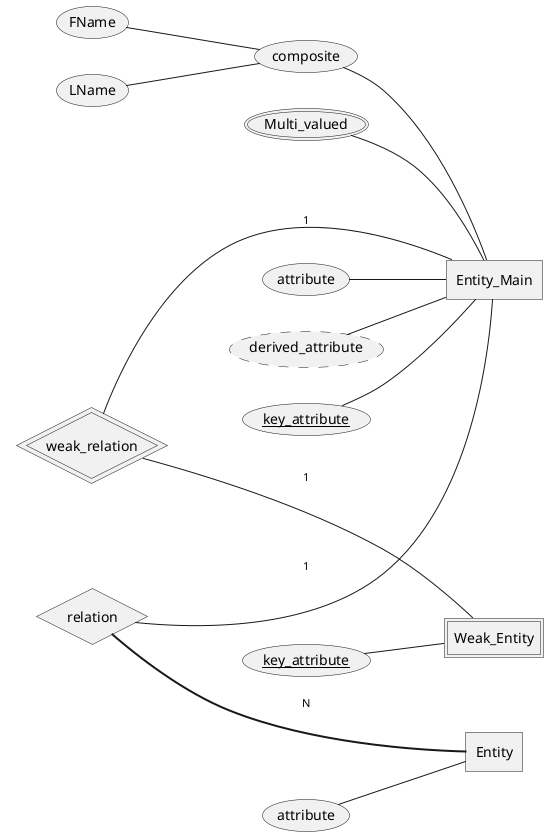
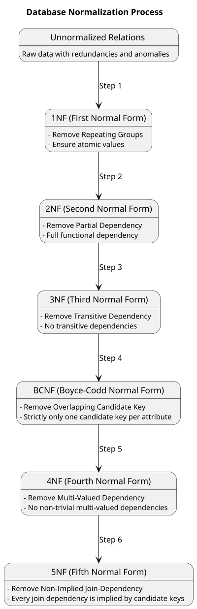

<!-- tags: ["CS"] -->

A database management system (DBMS) is a collection of programs that enables users to create and maintain a database. The DBMS is a general-purpose software system that facilitates the processes of defining, constructing, manipulating and sharing databases among various users and applications.

---

_**Data Model:**_ A data model is a collection of concepts that can be used to describe the structure of a database. It provides the necessary means to achieve abstraction.

_**Schema**_: In any data model, it is important to distinguish between the description of the database and the database itself. The description of a database is called the database schema, which is specified during database design and is not expected to change frequently.

## Overview of DBMS

1. _**Requirements Analysis:**_ 
   The very first step in designing a database application is to understand what data is to be stored in the database, what applications must be built on top of it, and what operations are most frequent and subject to performance requirements. In other words, we must find out what the users want from the database. This is usually an informal process that involves discussions with user groups, a study of the current operating environment and how it is expected to change, analysis of any available documentation on existing applications that are expected to be replaced or complemented by the database, and so on
2. _**Conceptual Database Design:**_ 
   The information gathered in the requirements analysis step is used to develop a highlevel description of the data to be stored in the database, along with the constraints that are known to hold over this data. This step is often carried out using the ER model, or a similar high-level data model.
3. _**Logical Database Design:**_ 
   We must choose a DBMS to implement our database design, and convert the conceptual database design into a database schema in the data model of the chosen DBMS. We will only consider relational DBMSs, and therefore, the task in the logical design step is to convert an ER schema into a relational database schema.
4. _**Schema Refinement:**_ 
   The fourth step in database design is to analyze the collection of relations in our relational database schema to identify potential problems, and to refine it. In contrast to the requirements analysis and conceptual design steps, which are essentially subjective, schema refinement can be guided by some elegant and powerful theory.
5. _**Physical Database Design:**_ 
   In this step we must consider typical expected workloads that our database must support and further refine the database design to ensure that it meets the desired performance criteria. This step may simply involve building indexes on some tables and clustering some tables, or it may involve a substantial redesign of parts of the database schema obtained from the earlier design steps.
6. _**Security Design:**_ 
   In this step, we identify different user groups and different roles played by various users (e.g., the development team for a product, the customer support representatives, the product manager). For each role and user group, we must identify the parts of the database that they must be able to access and the parts of the database that they should not be allowed to access, and take steps to ensure that they can access only the necessary parts.

## ER Diagram

The entity-relationship (ER) data model allows us to describe the data involved in a realworld enterprise in terms of objects and their relationships and is widely used to develop an initial database design. The ER model is important primarily for its role in database design. It provides useful concepts that allow us to move from an informal description of what users want from their database to a more detailed, and precise, description that can be implemented in a DBMS. Within the larger context of the overall design process, the ER model is used in a phase called conceptual database design.

_**Entity:**_ An entity is a “thing” or “object” in the real world that is distinguishable from all other objects. An entity is represented by a set of attributes. An entity set is a set of entities of the same type that share the same properties, or attributes.

_**weak_relationship:**_ A relationship is an association among several entities. A relationship set is a set of relationships of the same type.

### Attributes

- The basic concept that the ER model represents is an entity, which is a thing or object in the real world with an independent existence.
- An entity may be an object with a physical existence (for example, a particular person, car, house, or employee) or it may be an object with a conceptual existence (for instance, a company, a job, or a university course).
- Each entity has attributes—the particular properties that describe it. For example, an EMPLOYEE entity may be described by the employee’s name, age, address, salary, and job.
- A particular entity will have a value for each of its attributes. The attribute values that describe each entity become a major part of the data stored in the database.

_**Composite attributes:**_

- Composite attributes can be divided into smaller subparts, which represent more basicattributes with independent meanings.
- For example, the Address attribute of the EMPLOYEE entity can be subdivided into Street address, City, State.
- Attributes that are not divisible are called simple or atomic attributes.

_**Single-Valued Attribute:**_

- A single-valued attribute is an attribute that can have only one value for a particular entity within a database.
- In other words, each entity instance possesses a single, unique value for a single-valued attribute.
- For example, the ”Age” attribute of a person is single-valued because each person has a specific, singular age at any given time, and that age doesn’t change while referring to the same person.
- Single-valued attributes are straightforward and do not allow for multiple values or variations.

_**Multivalued Attribute:**_

- A multivalued attribute is an attribute that can have multiple values for a single entity within a database. This means that an entity can have more than one value associated with the same attribute.
- For instance, the ”Colors” attribute for a car is multivalued because a car can have one or more colors. A single-color car has only one value for the ”Colors” attribute, whereas a two-tone car has two values for the same attribute. Similarly, the ”College degrees” attribute for a person is multivalued because different individuals may have varying numbers of college degrees, ranging from zero to multiple degrees.
- Multivalued attributes introduce complexity into the data model, and they can have constraints, such as minimum and maximum values, to limit the number of values allowed for each entity.

_**Stored Attribute:**_

- A stored attribute is an attribute whose value is directly and explicitly stored in the database. These values are typically entered or updated by users or processes and are maintained as part of the entity’s data.
- Stored attributes are not computed or derived from other attributes or external sources. For example, in the context you provided, ”Birth date” is a stored attribute of a person because it represents an explicit value that is recorded in the database and is not calculated from other attributes or data.

_**Derived Attribute:**_

- A derived attribute is an attribute whose value can be calculated or derived from other attributes or data within the database.
- The value of a derived attribute is not stored explicitly but is computed or derived when needed based on specific rules, algorithms, or formulas.
- In the example you mentioned, ”Age” is a derived attribute of a person because it is calculated by subtracting the person’s ”Birth date” from the current date.
- The ”Age” attribute doesn’t have a directly stored value; instead, it is derived from the stored ”Birth date” attribute and the current date when required.

### ER Diagram Symbols

   

   <!-- REQ: -->

**[E-R Model to Relational Database](https://www.youtube.com/watch?v=Pe1PGnmbDh4&ab_channel=UnacademyComputerScience)**

## Relational Algebra

Relational algebra refers to a procedural query language that takes relation instances as input and returns relation instances as output. It performs queries with the help of operators. It gives a step by step process to obtain the result of the query.

### Select Operator ($\sigma$):

Select operator is an unary operator. It can be used to select those tuples of a relation
that satisfy a given condition.
Notation: $\sigma_{\theta}(R)$  

- $\sigma$: Select operator(read as sigma)
- $\theta$: Selection condition
- $R$: weak_relation name

  Result is a relation with the same scheme as R consisting of the tuples in R that satisfy condition $\theta$

  Syntax: $\sigma_{condition}(relation)$

### Project Operator $(\prod)$

The projection operator $\prod$ is one of the unary operators in relational algebra (RA) and is used to project columns from a relation. It can select specific columns from a given relation.  
_**Note:**_ It gives **distinct** fields only.  
_**Syntax:**_ $\prod_{A_1, A_2}(relation)$, this will return attribute A1 and A2 from the relation.

### Rename Operator $(\rho)$

The RENAME operation is used to rename the output of a relation. Sometimes it is simple and suitable to break a complicated sequence of operations and rename it as a relation with different names.  
**Syntax** : $\rho_{X}(R)$, it will rename the relation R to X

### Set operators

Union $(\cup)$, Intersection $(\cap)$, set difference $(–)$ are called set operators. Result of combining two relations with a set operator is a relation $\implies$ all its elements must be tuples having same structure. Hence scope of set operations is limited to union-compatible relations.

### Union Compatible weak relations

Two relations are union compatible if

1. Both have same number of columns
2. Names of attributes are same
3. Corresponding fields have same type
4. Attributes with the same name in both relations have same domain and datatype.

## Relational Calculus

Relational calculus is an alternative to relational algebra. In contrast to algebra, which is procedural, calculus is nonprocedural, or declarative, in that it allows us to describe the set of answers without being explicit about how they should be computed. The variant of the calculus that we present in detail is called the tuple relational calculus (TRC). Variables in TRC take on tuples as values. In another variant, called the domain relational calculus (DRC), the variables range over field values.

### Tuple Relational Calculus

TRC is a nonprocedural query language, where each query is of the form

$$
\{t | P(t)\}
$$

where t = resulting tuples,  

$P(t) =$ known as predicate and these are the conditions that are used to fetch t.  
$P(t)$ may have various conditions logically combined with OR $(\lor)$, AND $(\land)$, NOT $(\neg)$

It also uses quantifiers: 
$\exists \in  r(Q(t)) =$ "there exists" a tuple in t in relation r such that predicate $Q(t)$ is true.  
$\forall t \in r(Q(t)) = Q(t)$ is true "for all" tuples in relation r.  

$\{ P | \exists S \in Students(S.CGPA > 8 \land P.name = S.name \land P.age = S.age)\}$
: returns the name and age of students with a CGPA above 8.

### Domain Relational Calculus

$\{<x_1, x_2, ..., x_n> | P(x_1, x_2, ..., x_n)\}$

- $x_1, x_2, ..., x_n$ represent domain variables
- P represents a formula similar to that of the predicate calculus

  | Name    | Age | Marks | Subject |
  | ------- | --- | ----- | ------- |
  | David   | 23  | 78    | Maths   |
  | Mathew  | 29  | 54    | English |
  | Anand   | 29  | 89    | JAVA    |
  | Mitchel | 21  | 56    | Maths   |
  | Shaun   | 26  | 92    | Maths   |

  weak_relation Students  
  $\{< a, b> \exists a, b, c, d(< a, b, c, d> \in students \land c > 75)\}$  
  returns the name and age of students having marks above 75.

  <u>Note</u>: You have to mention the domain variables in the same order as given in the table.

## Joins

### Inner Join

An inner join returns only the rows where there is a match in both tables. It discards rows that do not have matching values in both tables.

**Relational Algebra Notation:**

$$
 R \bowtie S
$$

where $R$ and $S$ are two relations.

For example, if we have two relations $R(A, B)$ and $S(B, C)$, an inner join on the attribute $B$ (common in both tables) will be:

$$
 R \bowtie S = \{ (a, b, c) \, | \, (a, b) \in R \text{ and } (b, c) \in S \}
$$

### Left Outer Join

A left outer join returns all the rows from the left table (relation) and the matching rows from the right table. If there is no match, the result will contain NULL values for columns from the right table.

**Relational Algebra Notation:**

$$
 R \ltimes S
$$

### Right Outer Join

A right outer join returns all the rows from the right table and the matching rows from the left table. If there is no match, the result will contain NULL values for columns from the left table.

**Relational Algebra Notation:**

$$
 R \rtimes S
$$

### Full Outer Join

A full outer join returns all the rows when there is a match in either the left table or the right table. If there is no match, the result will contain NULL values for columns from the table that does not have a match.

**Relational Algebra Notation:**

$$
 R\quad ⟗  \quad S
$$

### Cross Join (Cartesian Product)

A cross join returns the Cartesian product of the two tables, meaning it combines each row of the first table with each row of the second table.

**Relational Algebra Notation:**

$$
 R \times S
$$

For example, if relation $R$ has 3 rows and relation $S$ has 2 rows, the Cartesian product $R \times S$ will have $3 \times 2 = 6$ rows.

### Theta Join

A theta join allows us to join tables based on a condition that uses comparison operators other than equality (e.g., <, >, ≤, ≥, ≠).

**Relational Algebra Notation:**

$$
 R \bowtie_\theta S
$$

where $\theta$ is a condition involving comparison operators.

### Practical Examples

Let's say we have two tables, `Students` and `Courses`:

#### Students Table:

| StudentID | Name  |
| --------- | ----- |
| 1         | Alice |
| 2         | Bob   |
| 3         | Carol |

#### Courses Table:

| CourseID | StudentID | CourseName |
| -------- | --------- | ---------- |
| 101      | 1         | Math       |
| 102      | 2         | Science    |
| 103      | 2         | History    |
| 104      | 4         | Literature |

- **Inner Join Example:** Retrieve students and their courses

  $$

    Students \bowtie_{Students.StudentID = Courses.StudentID} Courses
  $$

  Result:
  | StudentID | Name | CourseID | CourseName |
  |-----------|-------|----------|------------|
  | 1 | Alice | 101 | Math |
  | 2 | Bob | 102 | Science |
  | 2 | Bob | 103 | History |

- **Left Outer Join Example:** Retrieve all students and their courses (if any)

  $$

    Students \ltimes Courses
  $$

  Result:
  | StudentID | Name | CourseID | CourseName |
  |-----------|-------|----------|------------|
  | 1 | Alice | 101 | Math |
  | 2 | Bob | 102 | Science |
  | 2 | Bob | 103 | History |
  | 3 | Carol | NULL | NULL |

These examples illustrate how joins in relational algebra help us retrieve and combine data from multiple tables based on specific conditions.

## Functional Dependency and Decomposition

A functional dependency (FD) is a kind of integrity constraints that generalizes the concept of a key. Let $R$ be a relation schema and let $X$ and $Y$ be nonempty sets of attributes in $R$. We say that an instance $r$ of $R$ satisfies the FD $X \rightarrow Y$ . If the following holds for every pair of tuples $t1$ and $t2$ in $r$.

If $t1.X = t2.X$, then $t1.Y = t2.Y$

$X \rightarrow Y$ is read as $X$ functionally determines $Y$ or simply $X$ determines $Y$ . An FD $X \rightarrow Y$ essentially says that if two tuples agree on the values in attribute $X$, they must also agree on the values in attributes $Y$. If a constraints on $R$ states that there cannot be more than one tuple with a given $X$ value in any relation instance $r(R)$, that is $X$ is the key of $R$, the definition of an FD does not require that the set $X$ be minimal, the additional minimality condition must be met for $X$ to be a key.

If $X \rightarrow Y$ holds, where $Y$ is a set of all attribute and there is some subset $V$ of $X$ such that $V \rightarrow Y$ holds then $X$ is a super key.

**Trivial FD** 
If $X$ and $Y$ are attribute set of $R$ and $Y \subseteq X$ then $X \rightarrow Y$ is trivial FD. 
<u>Example:</u> Sid Sname $\rightarrow$ sid
Every trivial FD implies in relation.
 

**Non-trivial FD**  
If $X$ and $Y$ are attribute sets of R and no common attribute between $X$ and $Y$.  
$X \cap Y\neq$ empty set then $X \rightarrow Y$ is non- trivial FD. 
<u>Example</u>: sid $\rightarrow$ gpa
Sname $\rightarrow$ sid gpa
There may be a relation with no non-trivial FD.

**Closure of set of FDs**  
Set of all FDs that include given FDs as well as those that can be inferred from the given. FDs is called the closure of FDs. If $F$ is the set of given FDs the $F^{+}$ is called closure of $F$.

### Armstrong's Axioms

The following three rules, called Armstrong’s Axioms can be applied repeatedly to infer all FDs implied by a set $F$ of FDs. Let $X$, $Y$ and $Z$ denotes sets of attributes over a relation schema $R$.

- Reflexivity: If $X\supseteq Y$, then $X \rightarrow Y$. 
- Augmentation: If $X \rightarrow Y$, then $XZ \rightarrow YZ$ for any $Z$. 
- Transitivity: If $X  \rightarrow Y$ and $Y \rightarrow Z$, then $X \rightarrow Z$. 

Armstrong's Axioms are sound in that they generate only FDs in F + when applied
to a set $F$ of FDs. They are complete in that repeated application of these rules will
generate all FDs in the closure $F^+$. (We will not prove these claims.) It is convenient
to use some additional rules while reasoning about $F^+$ :

- Union: If $X — Y$and $X — Z$, then $X — YZ$.
- Decomposition: If $X \rightarrow YZ$ then $x \rightarrow Y$ and $X \rightarrow Z$
- Psuedo-transitivity rule: If $A \rightarrow B$ and $BC \rightarrow D$ then $AC \rightarrow D$

These additional rules are not essential; their soundness can be proved using Armstrong's Axioms.

## Normalization and Normal Forms

Database design theory includes design standards called normal forms. The process of making data and tables match these standards is called normalizing data or data normalization. By normalizing data, we eliminate redundant information and organize the table to make it easier to manage the data and make future changes to the table and database structure. This process removes the insertion, deletion, and modification anomalies. In normalizing your data, we usually divide large tables into smaller, easierto- maintain tables. We can then use the technique of adding foreign keys to enable connections between the tables.

Data normalization is part of the database design process and is neither specific nor unique to any particular RDBMS. These are in order, such as first, second, third, Boyce- Codd, fourth, and fifth normal forms. Each normal form represents an increasingly stringent set of rules; that is, each normal form assumes that the requirements of the preceding forms have been met. Many relational database designers feel that, if their tables are in third normal form, most common design problems have been addressed.

### Anomalies

An anomaly is a variation that differs in some way from what is said to be normal, with respect to maintaining a database.

- The basic operations performed on Databases are Record insertion, Record updation, and Record deletion.
- It is desirable for these operations to be straight forward and efficient.
- When relations are not fully normalized they exhibit anomalies.
- The design goal of database is too easily to understand and to maintain.
- Anomalies are problems that occur in un-normalized databases where all the data is stored in one table.

**Types of anomalies**

There are three types of anomalies that can arise in the database because of redundancy as follows:

1. Insertion anomaly: An insertion anomaly occurs when particular attributes cannot be inserted into the database without the presence of other attributes
2. Deletion anomaly: Deletion anomaly occurs when some particular attributes are lost because of the deletion of other attributes.
3. Updation anomaly: An updation anomaly occurs when one or more instances of duplicated data are updated but not all.

### Normal Forms

1. **First Normal Form (1 NF):** 
   No multi valued attributes, it must have atomic domain only.

2. **Second Normal Form (2 NF):** 

   - Second normal form (2NF) is based on the concept of fully functional dependency. A functional dependency $X \rightarrow Y$ is a full function dependency if the removal of any attribute A from X means that the dependency does not hold anymore; i.e., for any attribute $A \in X$, $(X -{A})$ does not functionally determine Y.
   - A functional dependency $X \rightarrow Y$ is a partial dependency if some attribute A can be removed from X and the dependency still holds; i.e., for some $A \in X$, $(X - {A}) \rightarrow Y$.
   - The test for 2NF involves testing for functional dependency whose left-hand side attributes are part of the primary key and the right-hand side is a nonprime attribute. If the primary key contains a single attribute the test need not be applied at all. 
     $X$: is any candidate key 
     $Y$: Proper subset of key 
     $A$: None prime attribute 
     Then we can say, $Y \rightarrow A$ is partial dependency.

3. **Third Normal Form (3NF):**
   Let $R$ be a relation schema, $X$ be a subset of the attributes of $R$, and $A$ be an attribute of $R$. $R$ is in third normal form if for every FD $X \rightarrow A$ that holds over $R$, one of the following statements is true:  

   - $A \in X$; that is, it is a trivial FD, or 
   - $X$ is a superkey, or 
   - $A$ is part of some key for $R$. 
     _Note: If Non-Prime Attribute determines non prime attribute then we can say there is a transistive dependency_

4. **Boyce Codd’s normal Form (BCNF)** 
   - Relation shloud be in 3NF first 
   - $A \in X$; that is, it is a trivial FD, or 
   - $X$ is a superkey
5. **Forth Normal Form (4NF)** 
   - Relation should be in BCNF
   - No Multi Valued Dependency
6. **Fifth Normal Form (5NF):**  
   It deals with join dependency

### Advantages and Disadvantages

**Advantages of Normalization:**

- Normalization helps to minimize data redundancy.
- Greater overall database organization.
- Data consistency within the database.
- Much more flexible database design.
- Enforces the concept of relational integrity.

**Disadvantages of Normalization:**

- You cannot start building the database before knowing what the user needs.
- The performance degrades when normalizing the relations to higher normal forms, i.e., 4NF, 5NF.
- It is very time-consuming and difficult to normalize relations of a higher degree.-
- Careless decomposition may lead to a bad database design, leading to serious problems.

**Lossless and Lossy Decompositions**

If a relation $R$ is decomposed into $R1$ and $R2$ and

$$
R1\cap R2 \neq = \phi
$$

then we say the decomposition is lossless.

**Dependency Preserving**

If a realation $R$ is decomposed into n relations $R1, R2, R3, ..., Rn$ then if the functional dependency set of R is exactly equal to union of broken relations, then we say the dependency is preserved.

$$
F.D\{R1 \cup R2 \cup R3 \cup ... \cup Rn \}= F.D\{R\}
$$

# Keywords

1. **Tautology** : In a database management system (DBMS), a tautology is a statement that is always true, regardless of the values of the individual statements that make it up
2. **Topological Sort**

# InDepth

<!-- REQ:-->

1.  TRC and DRC
2.  Graph Traversals
3.  Functional Dependencies, Decompositions and Normal Forms
